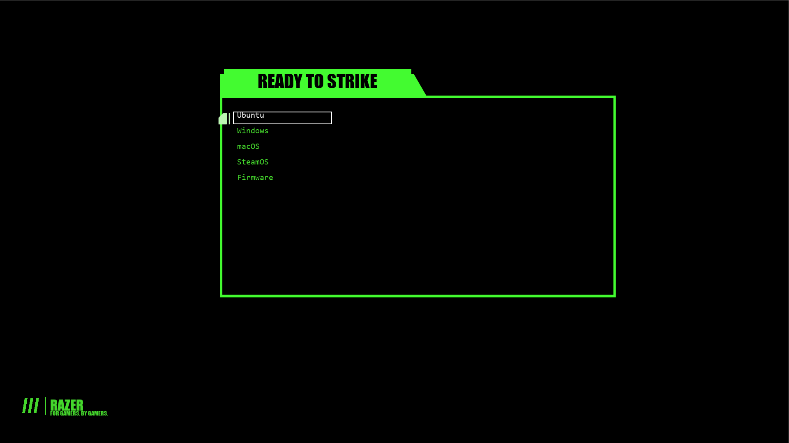

# Razer_GRUB_Theme
GRUB Theme for Razer Fans — For Gamers. By Gamers.



## Getting Started

```bash
git clone https://github.com/CasearF/Razer_GRUB_Theme.git
cd Razer_GRUB_Theme
chmod +x install.sh
sudo ./install.sh           # interactive menu
```

The installer takes optional commands so it can be scripted:

```bash
sudo ./install.sh install   # install + activate the Razer theme
sudo ./install.sh switch    # pick from themes already under /boot/grub/themes
sudo ./install.sh remove    # disable any active theme (files stay)
./install.sh status         # show current theme + installed ones (no root needed)
./install.sh help
```

## Credits

Layout adapted from [ROG_GRUB_Theme](https://github.com/thekarananand/ROG_GRUB_Theme),
recolored to the Razer palette (`#44D62C`) with a Razer wordmark.
